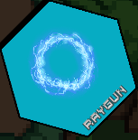

<h1 align="center">RatchPege</h1>

 
### **TopDown Rpg**

 

<!--   -->

---

## **Índice**
 

- [Introducción](#introducción)

  - [Datos del proyecto](#datos)
  - [Descripción del proyecto](#descripción-del-proyecto)
  - [Tecnologías](#tecnologías)
  
- [ScreenShots](#screenshots)

- [Armas](#armas)

- [Resultados y conclusiones](#resultados-y-conclusiones)

- [Bibliografía](#bibliografía)

---

## **Introducción**

---

## Datos

> Título: RatchPege

> Alumno: Jeremy Díaz Olivares

> Curso: Creacion Videojuegos con Unity3D

> Fecha de entrega: 08/03/2023

> Web: [RatchPege.com](https://mrjediol.netlify.app/)

> Itch.io: [RatchPege.io](https://mrjediol16.itch.io/rachpege?secret=HYsQAgDSmXK0KOOoa30pDmBjRM)

> Trailer: [RatchPege](https://www.youtube.com/watch?v=t3OReZLabys&ab_channel=MrJediol)

> Trailer: [RatchPege](./png/RachtPege)

Este proyecto se trata de mi proyecto final del curso de creación videojuegos con Unity3D, es un juego Rpg, con vista TopDown, en el que matas enemigos con un amplio catálogo de armas que también pueden de nivel.

Este proyecto surge por unir varios conceptos que me gustan mucho, como lo son los Rpgs, tener una gran cantidad de arsenal de armas (idea inspirada en la saga "Ratchet and Clank"), y el grindeo/farmeo de niveles.

Es mi primer juego, y ha sido realizado en un plazo de unos 2 meses, asi que todo esto es una exploración de conceptos y ejercicios para aprender.

---

## **Descripción del proyecto**

---

El objetivo de RatchPege es subir de nivel tanto el personaje como las armas, al desbloquear cada arma puedes destruir la barrera de cada zona y pasar a la siguiente, hasta que llegas al Boss final y al matarlo te has pasado el juego!, dando la posibilidad de que cada persona tenga sus propias estrategias de grindeo/farmeo, usando las combinaciones de armas que mas le gusten.

La idea del sistema de grindeo/farmeo, es la siguiente. Zonas amplias con muchos grupos de enemigos separados entre sí, grupos de enemigos, que al matar al último de cada grupo, se iniciará un contador de reaparición para ese grupo de enemigos. Cada zona tendrá diferentes disposiciones, tipos y cantidades de enemigos. 

Está pensado para que el jugador se haga su propia ruta de farmeo, dependiendo de lo rápido que mate a los grupos de enemigo de cada zona con su estrategia, de modo que su ruta termine donde empezó, y que al llegar al inicio, el primer grupo de enemigos ya haya reaparecido y pueda realizar esa ruta en Loop como método de farmeo.

### Objetivos personales

Con este proyecto pretendo aprender y desarrollar mis habilidades para la creación de videojuegos en Unity, y aprender programación en C#.

---

## **Tecnologías**

---

#### Unity

- El motor de videojuegos multiplataformas que he usado para crear el juego.

#### C#

- El lenguaje de programación usado para programar todo el juego.

#### Aseprite

- Para la creación y edición de algunos de los Sprites usados en el juego.

#### Notion

- Para la gestión del proyecto y para tomar notas.

#### Github

- Para el control de versiones del proyecto.

#### Clockify

- Para la gestión del tiempo.

---

## **ScreenShots**

---

---

## **Armas**

---

**Sword** 

Ataque Melee que viene por defecto desbloqueado. Su daño escala con el nivel del personaje.

---

**FireGun** 

Arma a distancia que dispara un proyectil de fuego que puede quemar a los enemigos con cierta probabilidad, el daño, tamaño, velocidad de proyectil, cooldown. etc escalan con el nivel del arma. 

| In Menu | In Game |
| :---: | :---: |
|  |  |

---

**IceGun** 

Arma a distancia que dispara un proyectil de hielo que puede congelar a los enemigos con cierta probabilidad, el daño, tamaño, velocidad de proyectil, cooldown. etc escalan con el nivel del arma.

| In Menu | In Game |
| :---: | :---: |
|  |  |

---

**RayGun** 

Arma a distancia que dispara un proyectil que teletransporta al player a la ubicaciones en la que se destruye, por cada enemigo que atraviese reinicia su duración y hace que llegue mas lejos, haciendo mas daño a cada enemigo y ganando mas experiencia por cada enemigo golpeado.

| In Menu | In Game |
| :---: | :---: |
|  |  |

---

**Blast** 

Arma que crea una explosion en la posición del raton despues de 6.5 segundos, esta pensada para usarse junto a Vortex.

| In Menu | In Game |
| :---: | :---: |
|  |  |

---

**Vortex** 

Arma a distancia que instancia un proyectil en la posicion del mouse, el daño, tamaño, cooldown. etc escalan con el nivel del arma. 

| In Menu | In Game |
| :---: | :---: |
|  |  |

---

**Quilava** 

Arma que con 2 instancias, en la primera se decide la posición inicial del proyectil, y en la empieza una cadena de explosiones que van desde la posición de la primera instancia hasta la posición de la segunda. 

| In Menu | In Game |
| :---: | :---: |
|  |  |

---

## **Resultados y conclusiones**

---

Como ya he dicho al ser mi primer proyecto programando y mi primer juego, no tenía claro hasta dónde iba a poder llegar, el scope y la idea del juego han ido variando conforme he avanzado con el proyecto.

Al principio simplemente quería un juego donde matar enemigos y subir de nivel, y con ello desbloquear armas/habilidades.

Decidí reducir el grindeo, acortar el juego y que fuera más lineal, con un camino claro por el que ir hasta el voz final y acabar el juego, para que se pudiera completar en una sesion de media hora de juego.

Con el combate a muele estoy contento a medias, el "Easy to learn, hard to master" no lo cumple de la manera que me gustaría, yo que le llevo muchas horas al juego haciendo pruebas, me siento cómodo en el combate con como esta montado el sistema de cancelar animaciones, pero he recibido feedback negativo en este aspecto de que al principio se puede hacer raro cancelar la animación de los ataques.

Con el combate a distancia, estoy contento con la lógica, pero no con el gamefeel y el juiciness, creo que mejoraría mucho las sensaciones al jugar, si tuviera animación al disparar, con un pequeño tiempo de casteo, pero con la vista TopDown, es complicado encontrar sprites que miren en las 4 direcciones, y que encajen y no encontré nada, y  decidí dejarlo sin animaciones y por lo tanto sin tiempo de casteo y screenshake al disparar.

Los enemigos son simples, pero cumplen su función, hice más de 10 pero en el juego final solo uso 4 que son los que me gustaron como quedaron, 3 como enemigos durante todo el juego y 1 como boss final.

En general estoy contento con el resultado, aunque el juego no se sienta como me gustaría, sobretodo porque he aprendido muchísimo con este proyecto, tanto de Unity, como de programación(C#), también haciendo la página web del juego, la página de itch.yo, el tráiler y este Readme para Github,he conocido muchas herramientas útiles y aprendido a usarlas en el proceso, lo cual me ayudara mucho en futuros proyectos.

Por último agradecer a Luis Antón Canalis y Aitor Lozano Bordón por ser magníficos profesores enseñarme Unity, C# y resolver dudas que he tenido en el proyecto.

---

## **Bibliografía**

---

- [ChatGpt](https://chat.openai.com/chat)

- [Stackoverflow](https://stackoverflow.co/)

- [Mui](https://mui.com/)
  
